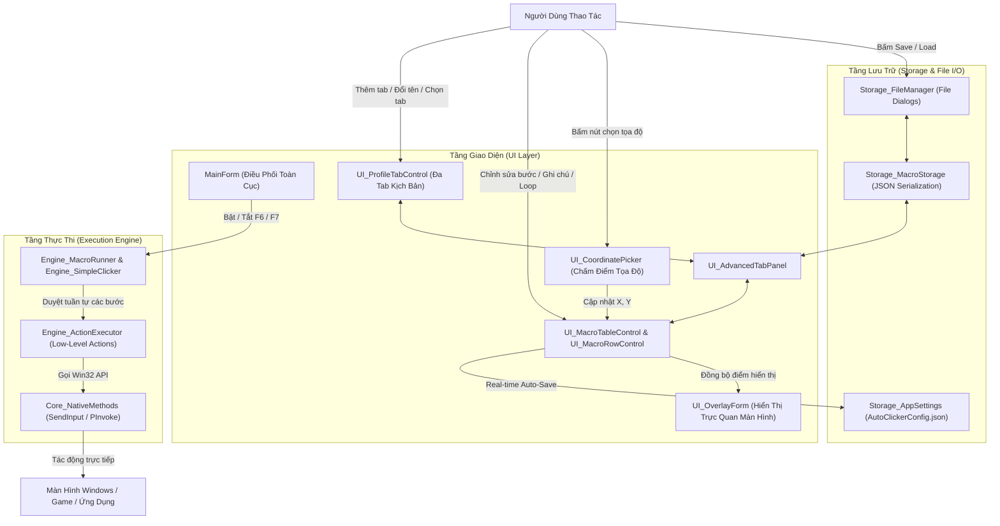

# Kiến Trúc Hệ Thống: Auto Clicker & Advanced Macro Engine

Tài liệu này mô tả toàn bộ cấu trúc kiến trúc dự án, phân lớp trách nhiệm (Layering), cấu trúc thư mục 2 phân hệ đối xứng, cùng bảng chi tiết toàn bộ các file mã nguồn và tính năng tương ứng.

---

## 📁 1. Cây Cấu Trúc File Dự Án

```text
📁 Auto Clicker by Max/
│
├── Auto Clicker by Max.md                  # Tài liệu kiến trúc toàn diện của dự án
├── AutoClicker-Save&Load/                  # Thư mục lưu cấu hình và kịch bản Macro
├── Auto Clicker by Max.exe                 # File chạy ứng dụng di động (Portable Executable)
├── build.bat                               # Script build tự động bằng Roslyn CSC Compiler
│
└── 📁 src_Auto Clicker by Max/             # Thư mục chứa toàn bộ mã nguồn C#
    ├── Core_DragDropHelper.cs             # Thuật toán tính toán vị trí thả khi Kéo-Thả dòng
    ├── Core_NativeMethods.cs              # Khai báo Win32 P/Invoke API (Chuột, Phím, Hotkey...)
    ├── MainForm.cs                        # Logic cửa sổ chính, phím tắt toàn cục, điều phối chung
    ├── MainForm.Designer.cs               # Bố cục giao diện Tab Simple, TabBar, BottomBar
    ├── Program.cs                         # Entry point, Single-Instance Guard & Error Logger
    ├── Storage_AppSettings.cs             # Quản lý cấu hình toàn cục (AutoClickerConfig.json)
    ├── Storage_FileManager.cs             # Quản lý hộp thoại File Dialog, nạp/lưu file JSON & TXT chung
    ├── UI_CustomControls.cs               # Bộ điều khiển UI bo góc hiện đại (Panel, Button, Input...)
    ├── UI_ModernScrollBar.cs              # Thanh cuộn tùy biến giao diện phẳng, mượt mà
    ├── UI_OverlayForm.cs                  # Lớp phủ màn hình hiển thị trực quan các điểm click số
    ├── UI_Theme.cs                        # ThemeTokens (Hệ màu Dark/Light, Font, Bo góc)
    │
    ├── 📁 Simple/                         # Phân hệ Auto Clicker Đơn Giản (Tab Simple)
    │   ├── Engine_SimpleClicker.cs        # Engine chạy click luồng nền cho Tab Simple (Basic)
    │   ├── UI_PointListControl.cs         # Bảng danh sách cuộn các điểm tọa độ (Tab Simple)
    │   └── UI_PointRowControl.cs          # Giao diện một dòng tọa độ trong danh sách Simple
    │
    └── 📁 Advanced/                       # Phân hệ Macro Kịch Bản Nâng Cao (Tab Advanced)
        ├── Engine_ActionExecutor.cs       # Thực thi trực tiếp Win32 API (Click, Drag, Key, Text)
        ├── Engine_MacroRunner.cs          # Quản lý luồng chạy kịch bản, vòng lặp, dừng khẩn cấp
        ├── Model_MacroActionType.cs       # Enum định nghĩa 8 loại hành động Macro
        ├── Model_MacroProfile.cs          # Class dữ liệu 1 kịch bản (Tên, Số vòng lặp, Danh sách bước)
        ├── Model_MacroStep.cs             # Class dữ liệu chi tiết cho 1 bước (Tọa độ, Hold, Delay, Note...)
        ├── Storage_MacroStorage.cs        # Thuật toán Serialization/Deserialization JSON độc lập
        ├── UI_AdvancedTabPanel.cs         # Giao diện chính Tab Advanced (Toolbar, Table, Status Footer)
        ├── UI_CoordinatePicker.cs         # Kính lúp toàn màn hình chấm tọa độ điểm (Nút Set Point)
        ├── UI_MacroRowControl.cs          # Giao diện dòng bước Macro (Dropdown, Tọa độ, Delay, Note...)
        ├── UI_MacroTableControl.cs        # Bảng danh sách cuộn các bước Macro, hỗ trợ Drag-Drop
        └── UI_ProfileTabControl.cs        # Thanh Sub-Tabs quản lý đa kịch bản (Thêm, Đổi tên, Nhân bản, Xóa)
```

---

## 📁 2. Bảng Chi Tiết Tính Năng Từng File

### 📁 A. Phân Hệ Cốt Lõi Dùng Chung (Shared Core at Root)

| File | Trách Nhiệm & Tính Năng Chi Tiết |
| :--- | :--- |
| **`Program.cs`** | • Điểm khởi đầu ứng dụng (`Main`).<br>• Kiểm tra tiến trình đang chạy (`Single-Instance Guard`) chỉ cho phép mở duy nhất 1 cửa sổ app.<br>• Bắt lỗi ngoại lệ chưa xử lý và ghi log vào `error.log`. |
| **`MainForm.cs`** | • Trung tâm điều khiển: Đăng ký Hotkey toàn cục (`F6` Start, `F7/Esc` Stop, `Space` Set Point).<br>• Quản lý trạng thái chuyển đổi qua lại giữa Tab **Simple** và Tab **Advanced**.<br>• Tự động lưu cấu hình Real-time khi người dùng chỉnh sửa bất kỳ thao tác nào.<br>• Đồng bộ hóa hiển thị trực quan lên màn hình qua `UI_OverlayForm`. |
| **`MainForm.Designer.cs`** | • Định nghĩa bố cục giao diện WinForms bằng code C# thuần túy.<br>• Bố cục thẻ chia cột khoa học: Khung Thời gian (`pnlTime`), Khung Nút chuột (`pnlBtn`), Bảng tọa độ (`pnlList`), Thanh phím nóng toàn cục và chân trang. |
| **`Core_NativeMethods.cs`** | • Tập hợp các hàm Win32 API giao tiếp trực tiếp với hệ điều hành: `SendInput`, `mouse_event`, `keybd_event`, `RegisterHotKey`, `UnregisterHotKey`, `PostMessage`, `GetCursorPos`, `SetCursorPos`. |
| **`Core_DragDropHelper.cs`** | • Module tính toán chỉ số thả (`targetIndex`) khi người dùng kéo thả các dòng trong danh sách để đổi vị trí bước (dùng chung cho cả Simple và Advanced). |
| **`Storage_AppSettings.cs`** | • Mô hình dữ liệu lưu trữ toàn bộ cấu hình app ra file `AutoClickerConfig.json`.<br>• Tự động nạp lại khi khởi động: Theme, Hotkeys, Luôn trên cùng (`AlwaysOnTop`), Danh sách điểm Simple và Cây đa tab kịch bản Advanced. |
| **`Storage_FileManager.cs`** | • Module chuyên biệt phụ trách toàn bộ việc mở hộp thoại File Dialog và đọc/ghi đĩa:<br>  - `SaveProjectWithDialog`: Hộp thoại lưu dự án `.json` đa tab hoặc file kịch bản đơn.<br>  - `LoadProjectWithDialog`: Hộp thoại nạp dự án `.json` và đồng bộ vào bộ quản lý tab.<br>  - `SavePointsWithDialog` / `LoadPointsWithDialog`: Hộp thoại lưu/nạp danh sách tọa độ Tab Simple (`.txt`).<br>  - Hiển thị thông báo thành công hoặc cảnh báo lỗi file trực quan. |
| **`UI_Theme.cs`** | • Hệ thống Token giao diện (`ThemeTokens`) quản lý màu sắc phẳng hiện đại.<br>• Hỗ trợ chuyển đổi tức thì giữa **Dark Theme** (xám tối dịu mắt) và **Light Theme** (sáng trang nhã).<br>• Cung cấp hàm tạo font chữ Monospace chuẩn xác để hiển thị tọa độ. |
| **`UI_CustomControls.cs`** | • Bộ thành phần UI vẽ thủ công mượt mà: `RoundedPanel`, `RoundedButton`, `NumberInput` (chống scroll vô ý khi chưa focus), `NoScrollComboBox`, `TimeSegmentInput` (nhập `hh:mm:ss` từng đoạn), `ToggleSwitch`. |
| **`UI_ModernScrollBar.cs`** | • Thanh cuộn custom giao diện tối giản thay thế thanh cuộn mặc định màu trắng của Windows.<br>• Hỗ trợ lăn chuột mượt mà, kéo thả thumb cuộn trang và tự động ẩn khi nội dung vừa khung. |
| **`UI_OverlayForm.cs`** | • Cửa sổ trong suốt `WS_EX_TRANSPARENT` phủ toàn màn hình.<br>• Vẽ các chấm tròn đánh số thứ tự điểm click phát sáng (`Glow Effect`), đường nối hành trình và highlight điểm đang chọn. |

---

### 📁 B. Phân Hệ Tab Simple (`src_AutoClicker/Simple/`)

| File | Trách Nhiệm & Tính Năng Chi Tiết |
| :--- | :--- |
| **`Engine_SimpleClicker.cs`** | • Luồng nền chuyên dụng cho Tab Simple.<br>• Hỗ trợ click tại vị trí con trỏ tự do (`Free Mouse Mode`) hoặc duyệt tuần tự danh sách điểm X-Y.<br>• Tự động gắn kết và chuyển đổi tọa độ theo Cửa Sổ Mục Tiêu (`Target Window`): Tự động tính toán lại tọa độ màn hình thực tế khi cửa sổ bị di chuyển.<br>• Tối ưu hóa `PostMessage` bắn trực tiếp vào handle của cửa sổ mục tiêu khi bật `FreeMouseMode`.<br>• Hỗ trợ Click Interval siêu nhanh từ `1ms` (với cơ chế Adaptive Hold tự động co giãn $\le 10\text{ms}$).<br>• Tự động dừng theo số lượt click hoặc thời gian đếm ngược (`hh:mm:ss`). |
| **`UI_PointListControl.cs`** | • Bảng chứa danh sách tọa độ của Tab Simple, tích hợp thanh cuộn phẳng và hỗ trợ kéo thả sắp xếp lại các điểm. |
| **`UI_PointRowControl.cs`** | • Giao diện của một dòng tọa độ trong danh sách Simple: Hiển thị số thứ tự, nút kéo `≡`, tọa độ `(X, Y)` và nút xóa `✕`. |

---

### 📁 C. Phân Hệ Tab Advanced Macro (`src_AutoClicker/Advanced/`)

| File | Trách Nhiệm & Tính Năng Chi Tiết |
| :--- | :--- |
| **`Engine_ActionExecutor.cs`** | • Thực thi trực tiếp các thao tác Win32 API cấp thấp cho từng loại bước:<br>  - Click chuột Trái, Phải, Giữa, Double Click.<br>  - Tự động chuyển đổi Tọa độ Tương đối của Cửa Sổ (`Relative Coordinates`) thành Tọa độ Màn hình thực tế tức thời (`ResolveActualScreenPoint`) bất kể cửa sổ bị di chuyển trên màn hình.<br>  - Hỗ trợ gửi trực tiếp `PostMessage` vào Handle của Cửa Sổ Mục Tiêu khi bật `FreeMouseMode`.<br>  - Kéo thả chuột mượt mà (`Drag & Drop`) từ điểm A đến B với nội suy chuyển động tự nhiên.<br>  - Nhấn phím đơn hoặc tổ hợp phím tắt (`Ctrl+C`, `Alt+F4`, `Shift+Tab`, `Space`...).<br>  - Gõ chuỗi văn bản (`Type Text`) tiếng Việt Unicode hoặc ký tự đặc biệt.<br>  - Lăn chuột giữa (`Scroll Step`) lên hoặc xuống.<br>  - Tạm dừng trễ thời gian (`Sleep / Delay`).<br>  - Thuật toán so khớp màu sắc (`MatchesColor`) với dung sai (`Tolerance`). |
| **`Engine_MacroRunner.cs`** | • Bộ điều phối luồng thực thi kịch bản nền (`Background Worker Thread`).<br>• Lặp tuần tự qua các bước được kích hoạt (`Enabled == true`).<br>• Xử lý các bước điều kiện thông minh tự động dịch theo Cửa Sổ Mục Tiêu:<br>  - `WaitColor`: Chờ điểm ảnh $A(X,Y)$ trong cửa sổ đạt đúng màu chỉ định mới chạy tiếp.<br>  - `IfColor`: Kiểm tra tức thì điểm ảnh $A(X,Y)$ trong cửa sổ, nếu sai màu thì bỏ qua bước kế tiếp.<br>  - `WaitChange`: Chờ điểm ảnh $A(X,Y)$ trong cửa sổ bị đổi màu khác so với lúc ban đầu.<br>• Quản lý số vòng lặp `Loop`, độ trễ sau bước (`DelayMs`), số lần lặp bước (`RepeatCount`).<br>• Tự động áp dụng dao động ngẫu nhiên thời gian (`Random Interval ±ms`) và tọa độ (`Random Jitter ±px`) giả lập người thật.<br>• Nhận tín hiệu dừng tức thì an toàn khi người dùng bấm `Esc` hoặc `F7`. |
| **`Model_MacroActionType.cs`** | • Enum định nghĩa 12 kiểu hành động Macro: `LeftClick` (0), `RightClick` (1), `MiddleClick` (2), `DoubleClick` (3), `DragDrop` (4), `KeyPress` (5), `TypeText` (6), `Delay` (7), `WaitColor` (8), `IfColor` (9), `WaitChange` (10), `RunScript` (11). |
| **`Model_MacroStep.cs`** | • Lớp dữ liệu cho 1 bước trong kịch bản:<br>  - `Id`, `Name`: Định danh và tên bước.<br>  - `ActionType`: Loại hành động.<br>  - `Enabled`: Trạng thái bật/tắt bước.<br>  - `StartPoint`, `EndPoint`: Tọa độ điểm bắt đầu và kết thúc (Tương đối theo Cửa Sổ hoặc Toàn màn hình).<br>  - `ProcessName`, `WindowTitle`, `RelativeToWindow`: Gắn kết Cửa Sổ Mục Tiêu cho từng bước.<br>  - `HoldMs`, `DelayMs`: Thời gian đè giữ và độ trễ sau bước.<br>  - `RepeatCount`, `ScrollStep`: Số lần lặp lại bước và nấc cuộn chuột.<br>  - `KeyData`: Tên phím bấm, chuỗi văn bản gõ, hoặc tên kịch bản mục tiêu (`RunScript`).<br>  - `TargetColor`, `ColorHex`, `Tolerance`: Thông số nhận diện màu sắc cho các bước điều kiện điểm ảnh.<br>  - `Note`: Ghi chú riêng cho bước.<br>  - Phương thức `Clone()` tạo bản sao độc lập. |
| **`Model_MacroProfile.cs`** | • Lớp dữ liệu cho 1 kịch bản hoàn chỉnh: Chứa `Name`, `LoopCount`, `RandomIntervalMs` (±ms), `RandomJitterPx` (±px), Cửa Sổ Mặc Định (`DefaultProcessName`, `DefaultWindowTitle`, `DefaultRelativeToWindow`) và danh sách các bước `List<MacroStep>`.<br>• Cung cấp hàm `CalculateEstimatedCycleMs()` tính toán ước lượng thời gian chạy 1 chu kỳ kịch bản (hỗ trợ tính toán đệ quy khi có bước gọi `RunScript`). |
| **`Storage_MacroStorage.cs`** | • Bộ chuyển đổi dữ liệu JSON tự xây dựng (Zero-Dependency) cực nhanh và nhẹ:<br>  - `ProjectToJson` / `ProjectFromJson`: Lưu và đọc dự án đa kịch bản kèm vị trí tab đang chọn.<br>  - `ToJson` / `FromJson`: Lưu và đọc 1 kịch bản đơn lẻ.<br>  - Tự động serialize/deserialize đầy đủ các thông số màu sắc (`ColorHex`, `Tolerance`), cửa sổ mục tiêu và các bước `RunScript`.<br>  - Xử lý escape chuỗi an toàn, chống lỗi định dạng văn bản đặc biệt. |
| **`UI_ProfileTabControl.cs`** | • Thanh Sub-Tabs đa kịch bản linh hoạt nằm trên cùng Tab Advanced:<br>  - Cho phép người dùng tạo bao nhiêu kịch bản tùy thích (`Script 1`, `Script 2`, `Master Script`...).<br>  - Nút `＋` tạo thêm tab kịch bản mới không giới hạn số lượng.<br>  - Nhấp đúp chuột vào bất kỳ tab nào để đổi tên trực tiếp tại chỗ (`Inline Rename`).<br>  - Nhấp chuột phải hiện menu ngữ cảnh: Đổi tên (`Rename`), Nhân bản (`Duplicate`), Xóa (`Delete`).<br>  - Nút `✕` nhanh trên tab đang active để đóng kịch bản (giữ lại tối thiểu 1 kịch bản). |
| **`UI_AdvancedTabPanel.cs`** | • Khung chứa chính của Tab Advanced:<br>  - Tích hợp thanh Sub-Tabs kịch bản (`ProfileTabControl`).<br>  - Sử dụng bảng `MacroTableControl` và dòng `MacroRowControl` đồng nhất cho mọi tab kịch bản.<br>  - Thanh công cụ Toolbar trên cùng: `➕ Add Step`, `Clear`, `Save`, `Load` và nút chọn Cửa Sổ Mục Tiêu `[ 🪟 Target: Selected Window ▾ ]`.<br>  - Thanh tùy chọn dưới bảng: `Loop` (0=∞), `Jitter: ± [px]` (bán kính lệch tọa độ ngẫu nhiên), `Time: ± [ms]` (độ lệch thời gian ngẫu nhiên).<br>  - Cơ chế khóa `_isLoadingUI` chống ghi đè dữ liệu rỗng khi khởi động app. |
| **`UI_MacroTableControl.cs`** | • Bảng cuộn danh sách các bước Macro gồm 10 cột hiển thị chuẩn xác với khung viền `RoundedPanel` bo góc sang trọng:<br>  - `No.` (Số thứ tự rộng 28px), `✔` (Bật/Tắt), `Win` (Icon Cửa Sổ 🪟 / 🖥️ rộng 24px), `Action Type` (Loại hành động rộng 90px), `Target / Key` (Tọa độ/Phím/Kịch bản rộng 118px), `Hold` (Giữ ms), `Delay` (Nghỉ ms), `Rep` (Số lần lặp), `Del` (Nút xóa đỏ ✕), `Note` (Ghi chú rộng 92px).<br>  - **Thao tác hàng loạt trực tiếp trên tiêu đề cột (`Batch Header Operations`)**:<br>    + Click `✔`: Check All / Uncheck All toàn bộ các bước.<br>    + Click `Win`: Mở menu chọn Target Window và gán hàng loạt cho toàn bộ các bước.<br>    + Click `Action Type`: Mở menu chọn loại hành động và đổi hàng loạt cho toàn bộ các bước.<br>    + Click `Hold`, `Delay`, `Rep`: Mở hộp thoại `BatchNumberInputDialog` nhập số hàng loạt (hỗ trợ `Enter` để lưu, `Esc`/để rỗng để hủy).<br>  - Hỗ trợ kéo thả đổi thứ tự bước mượt mà với vạch chỉ thị vị trí thả (`DropIndicator`).<br>  - Vòng đời nạp dữ liệu độc lập (`_isLoading`) chống xung đột cascade events. |
| **`UI_MacroRowControl.cs`** | • Giao diện cho từng dòng bước trong bảng:<br>  - Dùng chung 100% cho cả kịch bản thường lẫn kịch bản Combine.<br>  - Tự động biến đổi ô nhập liệu theo loại hành động:<br>    + Hiện Dropdown chọn kịch bản mục tiêu cho hành động `Run Script`.<br>    + Hiện tọa độ + nút chọn điểm cho Click.<br>    + Hiện ô xem màu `[ 🟩 Swatch ]` (click để mở ColorDialog) + Tọa độ + nút chọn điểm cho `Wait Color` / `If Color`.<br>    + Hiện `[ 🔄 Watch ]` + Tọa độ cho `Wait Change`.<br>    + Hiện ô text cho KeyPress/TypeText, hiện nấc lăn chuột cho Scroll.<br>  - Ô nhập ghi chú riêng biệt `Note` cho từng bước. |
| **`UI_CoordinatePicker.cs`** | • Cửa sổ kính lúp toàn màn hình mở ra khi bấm vào nút chọn tọa độ:<br>  - Tự động nhận diện Cửa Sổ bên dưới con trỏ chuột (`WindowFromPoint`) và chuyển đổi sang Tọa độ Client tương đối (`ScreenToClient`).<br>  - Hiển thị tọa độ trực tiếp `(X, Y)` và mã màu HEX thời gian thực kèm ô màu Swatch xem trước dưới con trỏ chuột.<br>  - Hỗ trợ chọn 1 điểm (cho thao tác Click), 2 điểm liên tiếp A $\rightarrow$ B (cho Drag & Drop), hoặc bắt cùng lúc cả Tọa độ lẫn Mã màu (cho `Wait Color` / `If Color`).<br>  - Bấm phím `Space` hoặc click chuột trái để xác nhận điểm, `Esc` để hủy. |

---

## 3. Sơ Đồ Luồng Dữ Liệu & Thực Thi (Data & Execution Flow)


