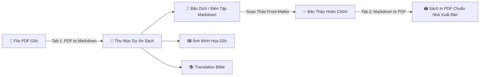

# 📖 Book Forge by Max v1.0 (Beta)
### Hệ Thống Bóc Tách Nội Dung Sách & Dàn Trang Xuất Bản Sách In Chuyên Nghiệp

[-0078D6?logo=windows&logoColor=white)](https://tranthangminh.github.io/products)
[](https://dotnet.microsoft.com/)
[](https://nodejs.org/)
[-orange)](#)
[-informational)](https://fb.me/maxiechen)

---

## 📑 Mục Lục
1. [Giới Thiệu Tổng Quan](#-1-giới-thiệu-tổng-quan)
2. [Các Tính Năng Đột Phá](#-2-các-tính-năng-đột-phá)
   - [2.1. Phân hệ PDF to Markdown (Bóc tách thông minh)](#21-phân-hệ-pdf-to-markdown-bóc-tách-thông-minh)
   - [2.2. Phân hệ Markdown to PDF (Dàn trang in ấn)](#22-phân-hệ-markdown-to-pdf-dàn-trang-in-ấn)
   - [2.3. Bộ Soạn Thảo Front Matter & Header Editor (Live Preview)](#23-bộ-soạn-thảo-front-matter--header-editor-live-preview)
   - [2.4. Khung Dự Án Translation Bible & QA Audit](#24-khung-dự-án-translation-bible--qa-audit)
3. [Yêu Cầu Hệ Thống (Phần Cứng & Phần Mềm)](#-3-yêu-cầu-hệ-thống)
4. [Hướng Dẫn Cài Đặt & Khởi Chạy Lần Đầu](#-4-hướng-dẫn-cài-đặt--khởi-chạy-lần-đầu)
5. [Hướng Dẫn Sử Dụng Chi Tiết (Workflow từ A - Z)](#-5-hướng-dẫn-sử-dụng-chi-tiết-workflow-từ-a---z)
6. [Mẹo & Kinh Nghiệm Thực Tế (Pro Tips)](#-6-mẹo--kinh-nghiệm-thực-tế-pro-tips)
7. [Xử Lý Sự Cố Thường Gặp (Troubleshooting)](#-7-xử-lý-sự-cố-thường-gặp-troubleshooting)
8. [Cấu Trúc Thư Mục Dự Án](#-8-cấu-trúc-thư-mục-dự-án)
9. [Tác Giả & Kênh Hỗ Trợ](#-9-tác-giả--kênh-hỗ-trợ)

---

## 🌟 1. Giới Thiệu Tổng Quan

**Book Forge by Max** là phần mềm desktop chuyên biệt trên hệ điều hành Windows, được xây dựng nhằm giải quyết triệt để bài toán khó khăn nhất trong quy trình biên tập và xuất bản sách: **Chuyển đổi hai chiều giữa Sách Điện Tử / PDF và Sách In Chuẩn Xuất Bản.**

Thông thường, khi bóc tách một cuốn sách PDF để dịch thuật hoặc biên tập lại, bạn sẽ đối mặt với hàng loạt vấn đề: văn bản bị dính liền, mất cấu trúc tiêu đề, hình ảnh minh họa bị vỡ, chú thích chân trang (footnotes) lộn xộn, và đặc biệt là không thể dàn trang lại thành một cuốn sách in ấn đẹp mắt với lề gáy so le, mục lục tự động và running header chuẩn nhà xuất bản.

**Book Forge by Max** kết hợp giữa giao diện C# WinForms trực quan, mượt mà cùng công cụ phân tích hình học PDF & engine dàn trang Typography headless siêu tốc, mang lại giải pháp khép kín:
- **Đầu vào (Input)**: Bóc tách file PDF bất kỳ thành tài liệu Markdown sạch sẽ, trích xuất ảnh chuẩn tỉ lệ và phân chia chương tự động.
- **Biên tập (Edit)**: Soạn thảo trang lót, lời tựa, ghi chú dịch giả với khung Live Preview song song.
- **Đầu ra (Output)**: Dàn trang từ Markdown xuất bản ngược lại thành file PDF in ấn chuẩn quốc tế (A5, B5, A4, Pocket...) có lề gáy so le (Gutter), Header động theo từng chương, Mục lục in (TOC) đo trang chuẩn xác và cây Bookmark phân cấp.

---

## ⚡ 2. Các Tính Năng Đột Phá

### 2.1. Phân hệ PDF to Markdown (Bóc tách thông minh)
- **Tự động phân cấp tiêu đề (Heading Clustering)**:
  - Thuật toán phân tích tọa độ không gian và phân cụm cỡ chữ (K-Means/Spatial Clustering) giúp nhận diện chính xác đâu là Chương chính (`H1`), Đề mục lớn (`H2`), và Tiểu mục con (`H3`), loại bỏ hoàn toàn việc phải gán thẻ thủ công.
- **Chia nhỏ chương thông minh (Subsection Splitting)**:
  - Cho phép tùy chọn tách chương lớn thành các file nhỏ dựa trên ngưỡng ký tự (*Character Threshold*, mặc định 25.000 ký tự - chuẩn vàng cho việc dịch thuật bằng LLM/AI).
- **Trích xuất hình ảnh độ phân giải gốc (Image Extractor)**:
  - Tự động tách toàn bộ ảnh minh họa (vector/raster) trong sách PDF, lưu thành file ảnh riêng biệt và chèn cú pháp liên kết Markdown chuẩn xác vào đúng vị trí đoạn văn tương ứng.
- **Lọc Header/Footer rác & Tái cấu trúc Footnote**:
  - Tự động nhận diện và xóa số trang, tiêu đề trang lặp lại ở đầu/cuối mỗi trang PDF gốc.
  - Gom và tái tạo chú thích chân trang (`[^1]`) chuẩn định dạng Markdown.

### 2.2. Phân hệ Markdown to PDF (Dàn trang in ấn)
- **Căn lề gáy so le chuẩn in ấn (Gutter Margins for Bookbinding)**:
  - Khi đóng gáy sách (keo nhiệt hoặc chỉ khâu), phần gáy luôn bị nuốt vào trong. Book Forge tự động tính toán **lề so le**: trang lẻ (Odd page) tăng lề trái, trang chẵn (Even page) tăng lề phải, đảm bảo cuốn sách khi mở ra đọc có khoảng cách lề hoàn hảo.
- **Tùy chọn độ sâu Mục lục in (TOC Depth: H1, H1 & H2, H1, H2 & H3)**:
  - Cho phép linh hoạt chọn mức độ chi tiết của trang Mục lục in tùy theo thể loại sách:
    - **`H1`**: Dành cho tiểu thuyết, sách văn học (chỉ hiện tên chương).
    - **`H1 & H2`**: Dành cho sách kỹ năng, sách kinh tế, self-help.
    - **`H1, H2 & H3`**: Dành cho sách kỹ thuật, giáo trình nghiên cứu chuyên sâu.
  - Tự động căn lề phải số trang thẳng tắp, hỗ trợ đường kẻ chấm (dot leaders) thanh lịch.
- **Hệ thống Đo lường 2-Pass chuẩn xác tuyệt đối**:
  - Không bao giờ bị lỗi nhảy số trang mục lục! Hệ thống sử dụng cơ chế Pass 1 in nháp để lấy số trang thực tế sau khi đã tính toán cả độ dài khối mục lục, sau đó tiêm ngược lại Pass 2 để tạo bản in hoàn hảo.
- **Cây Bookmark phân cấp PDF (Document Outlines)**:
  - Nhúng trực tiếp cây điều hướng PDF hỗ trợ người đọc trên máy tính/điện thoại nhảy ngay đến mục cần đọc chỉ bằng 1 cú nhấp chuột.
- **Running Headers động**:
  - Tự động lấy tiêu đề chương hiện tại để hiển thị trên đầu mỗi trang, chẵn lẻ đảo chiều tinh tế.
- **Đa dạng khổ sách chuẩn quốc tế**:
  - Hỗ trợ ngay lập tức: **A5** (148 x 210 mm), **B5** (176 x 250 mm), **A4** (210 x 297 mm), **Pocket Book** (110 x 178 mm), **Kindle Format**, **US-Trade** (152 x 229 mm).
- **Typography đỉnh cao với nhúng Font Lora**:
  - Tích hợp sẵn bộ font serif quốc tế cao cấp **Lora** (hỗ trợ trọn vẹn dấu tiếng Việt Unicode, biến thể Regular, Bold và Italic), tối ưu độ tương phản cho mắt khi đọc lâu.

### 2.3. Bộ Soạn Thảo Front Matter & Header Editor (Live Preview)
- Mở cửa sổ soạn thảo độc lập chuyên nghiệp cho các trang mở đầu cuốn sách:
  - Trang bìa lót (Half Title & Title Page).
  - Trang thông tin bản quyền & nhà xuất bản (Copyright Page).
  - Lời nói đầu / Lời bạt / Ghi chú của Dịch giả (Translator's Note).
- **Giao diện 2 cột song song**: Soạn thảo Markdown bên trái $\leftrightarrow$ Hiển thị trực quan (Live HTML/CSS Preview) bên phải theo thời gian thực.
- Tự động lưu và gắn kết trực tiếp vào cuốn sách khi bấm xuất bản.

### 2.4. Khung Dự Án Translation Bible & QA Audit
- **Tự động khởi tạo Translation Bible**:
  - Tạo sẵn 4 tài liệu cốt lõi cho mọi dự án dịch thuật sách:
    1. `Glossary.md`: Bảng từ điển thuật ngữ chuyên ngành.
    2. `Style-Guide.md`: Quy chuẩn xưng hô, văn phong, quy ước viết hoa/dấu câu.
    3. `Character-Voice.md`: Định hình ngữ điệu riêng cho từng nhân vật.
    4. `Context-Anchor.md`: Tóm tắt bối cảnh, niên đại, thế giới quan của tác phẩm.
- **QA Audit Engine**:
  - Kiểm tra tính toàn vẹn giữa nguyên tác và bản dịch: đối soát số lượng chương, kiểm tra thẻ đóng mở (`*`, `**`, `[]`, `()`), kiểm tra đường dẫn hình ảnh tránh tình trạng in ra bị mất hình.

---

## 💻 3. Yêu Cầu Hệ Thống

| Thành Phần | Cấu Hình Tối Thiểu (Minimum) | Cấu Hình Khuyên Dùng (Recommended) |
| :--- | :--- | :--- |
| **Hệ Điều Hành** | Windows 10 (64-bit) Version 1809 trở lên | Windows 11 (64-bit) bản cập nhật mới nhất |
| **Vi Xử Lý (CPU)** | Intel Core i3 / AMD Ryzen 3 (2.0 GHz) | Intel Core i5 / AMD Ryzen 5 trở lên (Đa nhân) |
| **Bộ Nhớ (RAM)** | 4 GB RAM | 8 GB RAM trở lên (khi xử lý sách PDF > 300 trang) |
| **Dung Lượng Đĩa** | 500 MB dung lượng trống | 2 GB dung lượng SSD tốc độ cao |
| **Màn Hình** | Độ phân giải 1280 x 720 (HD) | Độ phân giải 1920 x 1080 (Full HD) hoặc cao hơn |
| **Môi Trường .NET** | .NET Framework 4.8 (Windows 10/11 có sẵn) | .NET Framework 4.8 |
| **Môi Trường Bổ Trợ** | Node.js (v18+ LTS) | Node.js (v20+ LTS) |
| **Trình Duyệt** | Microsoft Edge (Chromium) có sẵn | Microsoft Edge bản mới nhất |

---

## 🚀 4. Hướng Dẫn Cài Đặt & Khởi Chạy Lần Đầu

### Bước 1: Tải về ứng dụng
- Tải file nén phát hành chính thức: **`Book Forge by Max v1.0 (Beta).zip`**.
- Giải nén file `.zip` vào bất kỳ thư mục nào trên máy tính của bạn (Ví dụ: `D:\Book Forge by Max\`).

### Bước 2: Chuẩn bị Node.js
- Nếu máy tính của bạn chưa có Node.js:
  - Truy cập trang chủ chính thức: [https://nodejs.org/](https://nodejs.org/)
  - Tải về và cài đặt bản **LTS (Long Term Support)** với các thiết lập mặc định.

### Bước 3: Chạy thiết lập tự động 1-Click (`setup.bat`)
- Vào thư mục vừa giải nén, nhấp đúp chuột vào file **`setup.bat`** (chỉ cần thực hiện **1 lần duy nhất**).
- File sẽ tự động kiểm tra Node.js và tải 5 gói thư viện xử lý sách cần thiết:
  ```bash
  npm install -g puppeteer pdf-lib pdf-parse markdown-it @pdf-lib/fontkit
  ```
- Khi màn hình hiện `[SUCCESS] All dependencies have been installed successfully!`, bạn nhấn phím bất kỳ để đóng cửa sổ.

### Bước 4: Khởi động phần mềm
- Nhấp đúp chuột vào **`Book Forge by Max.exe`** để mở ứng dụng và bắt đầu sáng tạo!

---

## 📖 5. Hướng Dẫn Sử Dụng Chi Tiết (Workflow từ A - Z)



### 1️⃣ Quy trình Bóc tách Sách (PDF to Markdown)
1. Mở phần mềm, chọn thẻ **PDF to Markdown**.
2. Bấm nút **Browse...** hoặc kéo thả file `.pdf` cần bóc tách vào ô đường dẫn.
3. Chọn vị trí lưu thư mục đầu ra:
   - `Same as source`: Lưu cùng thư mục với file PDF gốc.
   - `App folder`: Lưu tập trung tại thư mục `Book Forge by Max-Files/`.
   - `Custom folder`: Tự chọn thư mục mong muốn.
4. Tích chọn các tính năng nâng cao:
   - ☑ **Split H2/H3**: Tự động chia các chương dài thành các mục nhỏ.
   - ☑ **Extract Images**: Tự động bóc tách và lưu ảnh minh họa.
   - ☑ **Scaffold Bible**: Tạo bộ 4 file Translation Bible chuẩn mẫu.
5. Bấm nút **🚀 Start Extraction** và theo dõi thanh tiến trình xử lý.

### 2️⃣ Quy trình Soạn Thảo Trang Lót (Front Matter Editor)
1. Sau khi đã có bản thảo dịch, bấm vào nút **Front Matter & Header Editor** trên thanh công cụ.
2. Cửa sổ 2 cột mở ra:
   - Nhập thông tin Tựa sách, Tác giả, Dịch giả, Lời đề tặng, Trang bản quyền.
   - Sử dụng các nút mẫu có sẵn (*Insert Header Template*, *Insert Translator Note*).
3. Cột bên phải sẽ tự động hiển thị bản xem trước (Live Preview) theo định dạng Typography của trang sách in.
4. Bấm **Save Changes** để lưu lại vào dự án.

### 3️⃣ Quy trình Xuất Bản Sách In (Markdown to PDF)
1. Chuyển sang thẻ **Markdown to PDF**.
2. Chọn thư mục dự án chứa các file Markdown (hoặc file Markdown đơn lẻ).
3. Thiết lập các thông số xuất bản:
   - **Source Mode**: Chọn `Translated` (Bản dịch) hoặc `Original` (Nguyên tác).
   - **Paper Size**: Chọn khổ sách mong muốn (phổ biến nhất là `A5` cho sách văn học, `B5` cho giáo trình).
   - **Binding Mode**: Chọn `Print (Bookbinding Gutter)` để tạo lề so le cho việc đóng gáy in.
   - **Menu depth**: Chọn độ sâu mục lục in (`H1`, `H1 & H2`, hoặc `H1, H2 & H3`).
   - **Font**: Chọn `Lora (Recommended)` để nhúng font serif tiêu chuẩn.
4. Bấm nút **🖨️ Publish to PDF**.
5. Sau vài giây, file PDF in ấn tuyệt đẹp sẽ được tạo ra, tự động mở lên để bạn kiểm tra!

---

## 💡 6. Mẹo & Kinh Nghiệm Thực Tế (Pro Tips)

### 📌 Mẹo 1: Căn lề gáy (Gutter) chuẩn theo độ dày sách
- **Sách mỏng (< 120 trang, đóng bấm kim hoặc may chỉ nhẹ)**:
  - Chọn Binding Mode: `Print`. Lề gáy mặc định $20\text{mm} - 22\text{mm}$ là vừa đẹp.
- **Sách dày (> 250 trang, dán keo nhiệt gáy cứng)**:
  - Gáy sách dán keo sẽ làm mất từ $5\text{mm} - 8\text{mm}$ khoảng cách đọc bên trong. Chế độ `Print` của Book Forge đã được bù trừ lề trong lên tới $24\text{mm}$, giúp người đọc không phải dùng tay bẹt mạnh gáy sách vẫn đọc rõ từng chữ sát mép trong.
- **Sách đọc trên Ipad / Tablet / Laptop**:
  - Hãy chuyển Binding Mode sang `Digital`. Lề 2 bên sẽ cân đối đều chằn chặn, tối ưu không gian hiển thị trên màn hình.

### 📌 Mẹo 2: Lựa chọn Menu Depth (Độ sâu mục lục) phù hợp
- **Tiểu thuyết / Truyện ngắn**: Hãy luôn chọn `H1`. Người đọc chỉ cần biết Chương 1, Chương 2 ở trang nào; việc đưa H2/H3 vào sẽ làm loãng và dài dòng mục lục.
- **Sách Kỹ Năng / Kinh Doanh**: Hãy chọn `H1 & H2`. Độc giả của dòng sách này thường quét mục lục để tìm bài học hoặc luận điểm quan trọng.
- **Tài Liệu Chuyên Ngành / Sách Lập Trình**: Hãy chọn `H1, H2 & H3` để người đọc tra cứu chính xác từng hàm, từng khái niệm nhỏ.

### 📌 Mẹo 3: Tận dụng Translation Bible khi dịch bằng AI (ChatGPT / Claude / Gemini)
- Trong thư mục bóc tách, Book Forge đã tạo sẵn thư mục `translation_bible/`.
- Trước khi yêu cầu AI dịch bất kỳ chương nào, hãy đính kèm nội dung của `Glossary.md` và `Style-Guide.md` vào câu lệnh (System Prompt). AI sẽ dịch chuẩn xác 100% ngôi xưng hô và thuật ngữ thống nhất từ đầu sách đến cuối sách!

### 📌 Mẹo 4: Quản lý hình ảnh minh họa
- Thư mục `images/` được đặt cùng cấp với các file Markdown.
- Trong file Markdown, giữ nguyên cú pháp liên kết tương đối: ``. Khi xuất PDF, Book Forge sẽ tự động căn giữa ảnh, tối ưu kích thước để ảnh không bị tràn trang và tự động ngắt trang thông minh.

---

## 🛠️ 7. Xử Lý Sự Cố Thường Gặp (Troubleshooting)

### ❓ Câu hỏi 1: Khi bấm bóc tách hoặc xuất PDF, phần mềm báo lỗi thiếu Node.js?
- **Khắc phục**:
  1. Kiểm tra xem bạn đã cài Node.js chưa bằng cách mở cửa sổ cmd và gõ `node -v`.
  2. Nếu chưa có, tải bản LTS tại [nodejs.org](https://nodejs.org/).
  3. Sau khi cài Node.js, nhớ nhấp đúp vào file `setup.bat` trong thư mục phần mềm để cài đặt các thư viện lõi.

### ❓ Câu hỏi 2: Xuất PDF xong trang Mục lục có bị đè chữ hoặc thiếu số trang không?
- **Khắc phục**: Hoàn toàn không! Từ phiên bản **v1.0 (Beta)**, Book Forge đã áp dụng thuật toán `Token Marker Extraction` kết hợp `Pass 1 Draft Injection` và hệ thống Flexbox co giãn (`box-sizing: border-box`), đảm bảo cột tên chương co lại tự động và số trang luôn căn thẳng tắp lề phải bất kể cấp độ thụt lề H1, H2 hay H3.

### ❓ Câu hỏi 3: File PDF scan dạng chụp ảnh (Scanned PDF) có bóc tách được không?
- **Lưu ý**: Book Forge chuyên xử lý các file PDF gốc có lớp văn bản (Text Layer / Digital PDF). Nếu file PDF là ảnh chụp scan hoàn toàn (không thể bôi đen copy chữ), bạn nên chạy qua phần mềm OCR (như Adobe Acrobat OCR hoặc ABBYY FineReader) trước khi đưa vào Book Forge.

---

## 📁 8. Cấu Trúc Thư Mục Dự Án

```text
📁 Book Forge by Max/
│
├── Book Forge by Max.exe                 # File chạy ứng dụng Windows chính (Portable)
├── build.bat                             # Script biên dịch C# & tự động đóng gói release .zip
├── setup.bat                             # Script 1-click cài đặt môi trường Node.js & npm
├── README.txt                            # Hướng dẫn nhanh đính kèm gói phát hành
├── Book Forge by Max.md                  # Tài liệu hướng dẫn toàn diện của dự án
├── README.md                             # Tài liệu hiển thị trang chủ GitHub
├── _BookForgeConfig.json                 # Tự động lưu cấu hình và tùy chọn người dùng
│
└── 📁 src_Book Forge by Max/             # Mã nguồn dự án
    ├── app.ico / app.png                 # Icon và nhận diện thương hiệu
    ├── Program.cs                        # Entry point, Single-Instance Guard & Exception Handler
    ├── MainForm.cs / Designer.cs         # Giao diện chính WinForms (Tab PDF, Tab MD, Tab QA, Tab Info)
    ├── UI_CustomTitleBar.cs              # Thanh tiêu đề hiện đại không viền (Custom Chrome Bar)
    ├── UI_FrontMatterEditorForm.cs       # Cửa sổ soạn thảo Front Matter 2 cột Live Preview
    ├── UI_InfoTabPanel.cs                # Thẻ thông tin phiên bản, tác giả và liên kết
    ├── Core_WorkspaceScaffolder.cs       # Khởi tạo khung thư mục dự án và Translation Bible
    ├── Core_EngineRunner.cs              # Bộ điều phối luồng thực thi Node.js ngầm và bắt log
    │
    ├── 📁 Templates/                     # Các mẫu văn bản Markdown chuẩn
    │   ├── _HEADER-original.md
    │   ├── _HEADER-translated.md
    │   ├── _TRANSLATOR_NOTE_original.md
    │   ├── _TRANSLATOR_NOTE_translated.md
    │   └── 📁 translation_bible/         # Mẫu khung Character, Context, Glossary, Style
    │
    └── 📁 script/                        # 38 Module xử lý sách lõi (Node.js Engine)
        ├── 01__pdf_geometry.js          # Phân tích hình học và đo tọa độ PDF
        ├── 02__toc_parser.js            # Trích xuất và phân tích mục lục PDF gốc
        ├── 03__rich_markdown_formatter.js # Định dạng Markdown giàu ngữ nghĩa
        ├── 04__image_extractor.js       # Trích xuất hình ảnh độ nét cao
        ├── 05_md_chapter_splitter.js    # Chia nhỏ chương theo ngưỡng ký tự
        ├── 07__pdf_publisher.js         # Engine xuất bản PDF 2-Pass chuẩn in ấn
        ├── 07_outline_engine.js         # Engine tạo cây Bookmark PDF phân cấp
        ├── 07_toc_engine.js             # Engine tạo trang Mục lục in động
        ├── 07_gutter_engine.js          # Engine căn lề gáy so le trang chẵn / lẻ
        ├── 07_header_engine.js          # Engine tạo Running Header theo chương
        └── Lora-VariableFont_wght.ttf   # Font chữ in ấn quốc tế Lora nhúng sẵn
```

---

## 👨‍💻 9. Tác Giả & Kênh Hỗ Trợ

Phần mềm được nghiên cứu, thiết kế và phát triển độc lập bởi **Trần Thắng Minh (Max)**.

- 🌐 **Website Sản Phẩm**: [tranthangminh.github.io/products](https://tranthangminh.github.io/products)
- 💬 **Facebook Cá Nhân**: [fb.me/maxiechen](https://fb.me/maxiechen)
- ☕ **Ủng Hộ Tác Giả (Support Me)**: [ko-fi.com/maxiechen96](https://ko-fi.com/maxiechen96)

---

> *Chúc bạn tạo nên những cuốn sách in ấn tuyệt đẹp và những dự án dịch thuật chất lượng cao cùng **Book Forge by Max**!* 🚀
