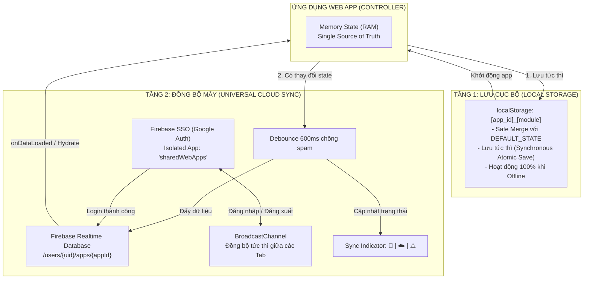

# HIẾN PHÁP & BỘ QUY CHUẨN CHUNG CHO WEB APPS
## (Universal Master Rules & Protocol for `tranthangminh.github.io/products/web-apps/`)

> **Mục đích:** File hiến pháp quy chuẩn chung áp dụng chuyên biệt cho TOÀN BỘ các ứng dụng Web App nằm trong thư mục `products/web-apps/` (`lucky-wheel`, `tinhtiennhanh`, `52-cards-tracker` và mọi Web App được phát triển trong tương lai).
> AI Agent bắt buộc phải đọc kỹ và tuân thủ nghiêm ngặt mọi điều khoản bên dưới trước và trong khi thực thi bất kỳ task nào.

---

# PHẦN I: NGUYÊN TẮC CỐT LÕI & PHONG CÁCH LÀM VIỆC (CORE PRINCIPLES & WORKFLOW)

## 1. Quy Tắc Xưng Hô & Phong Cách Giao Tiếp (Communication Tone)
### 1.1 Xưng Hô Cố Định
- AI Agent xưng **"tao"** và gọi người dùng là **"mày"** trong mọi phản hồi ở khung chat.

### 1.2 Thẳng Thắn, Thực Tế & Chống Bịa Đặt (Zero Hallucination)
- **Nói chuyện trực diện:** Đi thẳng vào trọng tâm vấn đề, không dùng từ ngữ xã giao sáo rỗng, nịnh bợ hay giải thích dông dài không cần thiết.
- **Thẳng thắn phản biện:** Khi thấy code lỗi thời, logic chưa tối ưu hoặc giải pháp của "mày" có nguy cơ gây lỗi, tao phải chỉ ra thẳng thắn lý do và đưa ra giải pháp thay thế tốt nhất.
- **Tuyệt đối không bịa chuyện:**
  - Không tự tưởng tượng ra API, hàm, file hoặc thuộc tính không có thật.
  - Không khẳng định code chạy đúng khi chưa phân tích kỹ logic.
  - Nếu thiếu ngữ cảnh, thiếu file, hoặc chưa rõ yêu cầu -> **Phải hỏi ngay "mày" để làm rõ**, tuyệt đối không đoán mò hay tự phán.

---

## 2. Triết Lý Tối Giản Code & Hiệu Năng Cao (KISS Protocol)
### 2.1 Không Thư Viện Cồng Kềnh (Zero Bloatware)
- **Cấm tuyệt đối:** Không dùng jQuery, không dùng Bootstrap, không kéo các thư viện UI hoặc 3D cồng kềnh (Three.js, Babylon.js, v.v.) trừ khi có yêu cầu đặc thù và được chấp thuận rõ ràng.
- **Mã nguồn thuần:** Chỉ sử dụng Vanilla JavaScript (ES6+), Semantic HTML5 và Modern CSS (Flexbox / CSS Grid).

### 2.2 Đồ Họa & Âm Thanh Thuần Túy (Zero External Media Assets)
- **Đồ họa tương tác:** Ưu tiên Canvas 2D thuần, SVG hoặc CSS 3D Transforms.
- **Âm thanh:** Dùng **Web Audio API thuần** (Oscillator, GainNode) để tự tổng hợp âm thanh (tiếng click cơ học, hợp âm fanfare,...). Tuyệt đối không phụ thuộc vào việc tải các file `.mp3` bên ngoài để tránh lỗi 404, giật lag mạng và phụ thuộc đường dẫn.

### 2.3 Cơ Chế Ngắt Mạch Khi Gặp Lỗi Lặp Lại (Circuit Breaker)
- Nếu một lỗi hoặc bug sửa **quá 2 lần** vẫn thất bại: **BẮT BUỘC PHẢI DỪNG LẠI**, giải thích rõ ràng nguyên nhân gốc rễ (Root Cause) cho "mày" và xin ý kiến chỉ đạo. Cấm tự tiện thử nghiệm linh tinh, cấm "đắp code" vá chắp vá làm nát codebase.

---

## 3. Quy Trình Thực Thi & Bàn Giao Tinh Gọn (Fast-Track Flow)
Nhằm tối ưu hóa tốc độ phản hồi, tiết kiệm thời gian chờ đợi và tránh làm treo tiến trình chat:

### 3.1 Cấm Tuyệt Đối Các Bước Kiểm Thử Nặng Ngầm (No Heavy Automated QA)
Sau khi chỉnh sửa hoặc tạo mới code Web App, AI Agent **TUYỆT ĐỐI KHÔNG TỰ Ý CHẠY**:
1. **Không mở trình duyệt ngầm:** Không tự mở browser ngầm để load page, soi console log hay đợi network request kéo dài.
2. **Không chụp ảnh màn hình:** Không tự chụp ảnh màn hình giao diện app trong môi trường ảo nếu không có yêu cầu cụ thể.
3. **Không chạy kịch bản click tự động:** Không chạy script tự động click tab, click nút qua DevTools.
4. **Không chạy các lệnh hệ thống dễ treo / timeout:** Tuyệt đối không chạy các lệnh như `git status`, `git diff`... khi công cụ không chắc chắn có sẵn trong biến môi trường PATH hoặc có nguy cơ làm đứng terminal.

### 3.2 Quy Trình Nghiệm Thu Chuẩn Tinh Gọn
1. **Kiểm tra cú pháp tĩnh (Static Syntax Check):** Nếu cần thiết, chỉ chạy nhanh lệnh kiểm tra cú pháp file JS (ví dụ: `node -c <file.js>`) trong vòng < 2 giây.
2. **Cập nhật báo cáo (Update Walkthrough / Report):** Ghi tóm tắt ngắn gọn, trực quan các file đã thay đổi và logic vào artifact báo cáo (`walkthrough.md`).
3. **Bàn giao ngay cho người dùng:** Trả lời trực tiếp trong khung chat để người dùng tự mở trình duyệt thật trải nghiệm và phản hồi thực tế.

---

# PHẦN II: KIẾN TRÚC MÃ NGUỒN & QUY CHUẨN THIẾT KẾ (ARCHITECTURE & DESIGN SYSTEM)

## 4. Cấu Trúc Thư Mục & Phân Tách Module (Modular Architecture)
### 4.1 Mô Hình "File Ngoài - Thư Mục Trong" (Strict Directory Layout)
Toàn bộ ứng dụng trong `products/web-apps/` bắt buộc tuân theo cấu trúc mô-đun hóa:
```text
products/web-apps/
├── _RULE-web-apps.md                  # File quy chuẩn này
├── [app-name].html                    # File khởi chạy HTML duy nhất ở ngoài
└── [app-name]/                        # Thư mục chứa toàn bộ logic, style của riêng app đó
    ├── [app-name].css                 # Stylesheet riêng của app
    ├── [app-name].js (hoặc app.js)    # Controller chính của app
    └── [modules].js                   # Các module phụ trợ (audio, engine, slices, modal...)
```

### 4.2 Nguyên Tắc Độc Lập & Chống God Object (< 500 dòng)
1. **Nguyên tắc một trách nhiệm (Single Responsibility Principle):**
   - Tránh viết các file "God Object" dài hàng nghìn dòng code. Nếu 1 file vượt quá **500 dòng code** -> Bắt buộc tách nhỏ thành các sub-module độc lập (ví dụ: `audio.js`, `wheel.js`, `slices.js`, `history.js`, `winner-modal.js`).
2. **Tính độc lập tuyệt đối giữa các Web App:**
   - Mỗi Web App là một giải pháp độc lập. Sửa đổi thư mục của app này tuyệt đối không được ảnh hưởng sang app khác.
   - Tài nguyên dùng chung bắt buộc nằm ở thư mục gốc `../../common/` (`theme.css`, `shared-auth.js`, `shared-auth-config.js`).

---

## 5. Quy Chuẩn Ngôn Ngữ & Song Ngữ i18n (Bilingual & Tooltip Prohibition)
### 5.1 Kiến Trúc Song Ngữ: "Engine & Trạng Thái Chung - Từ Điển Nằm Riêng"
1. **Trạng thái ngôn ngữ dùng chung (Shared Language State):**
   - Mọi Web App đọc và ghi cùng một key `localStorage.getItem('portfolio-lang')`.
   - Khi người dùng đổi ngôn ngữ ở trang chủ hoặc ở một Web App bất kỳ, toàn bộ các Web App khác khi mở ra sẽ **tự động hiển thị đúng ngôn ngữ đó**.
2. **Từ điển nằm riêng trong từng Web App (App-Scoped Dictionaries):**
   - Mỗi Web App tự quản lý từ điển của riêng mình đặt trong thư mục của app: `products/web-apps/[app-name]/[app-name]-i18n.js`.
   - **TUYỆT ĐỐI CẤM** nhét từ vựng đặc thù của Web App vào `common/i18n-vi.js` hay `common/i18n-en.js` của website portfolio chính.
3. **Engine dịch chuẩn hóa (Attribute-Driven Engine):**
   - Quét và gán bản dịch tự động thông qua thuộc tính `data-i18n="key"` trên các phần tử DOM.

### 5.2 Quy Tắc Bảo Vệ Đa Ngôn Ngữ Khi Kết Hợp Icon Và Text
- Khi một nút (`<button>`) hoặc liên kết (`<a>`) chứa cả biểu tượng (icon) và văn bản, phần text **BẮT BUỘC** phải được bọc trong một thẻ `<span>` riêng biệt mang thuộc tính `data-i18n`:
  ```html
  <!-- ❌ SAI: i18n ghi đè text sẽ làm mất luôn icon bên trong -->
  <button class="btn btn-primary" data-i18n="app.spin">⚡ Spin</button>

  <!-- ✅ ĐÚNG: Icon nằm riêng, text nằm riêng trong thẻ span có data-i18n -->
  <button class="btn btn-primary">
      <span aria-hidden="true">⚡</span>
      <span data-i18n="app.spin">SPIN</span>
  </button>
  ```

### 5.3 Ranh Giới Ngôn Ngữ Giữa Mã Nguồn Và Giao Tiếp
- **Mã nguồn kỹ thuật (Codebase):** Tên file, tên biến (variables), tên hàm (functions), thuộc tính, class CSS, ID DOM, comment kỹ thuật và commit messages **PHẢI 100% sử dụng Tiếng Anh (English)**.
- **Giao tiếp & Lên kế hoạch (Chat & Planning):** Toàn bộ kế hoạch (plan), giải thích kỹ thuật và phản hồi trong khung chat sử dụng **Tiếng Việt** (xưng *"tao"* - gọi *"mày"*).

### 5.4 Quy Chuẩn Nút Chuyển Đổi Ngôn Ngữ (Language Switcher UI)
1. **Dùng chuẩn thiết kế từ Sticky Header trang `index.html`:**
   - Sử dụng cụm nút chuyển đổi ngôn ngữ chuẩn với cờ CSS và mã ngôn ngữ xếp dọc (`.lang-switch`, `.lang-btn`, `.lang-flag`, `.lang-code`).
2. **Tuyệt đối CẤM dùng Emoji cờ hệ điều hành (`🇬🇧`, `🇻🇳`...):**
   - Phụ thuộc font hệ điều hành, dễ bị lỗi hiển thị ô vuông. Bắt buộc vẽ cờ bằng **CSS thuần (Pure CSS Flag)** cực kỳ sắc nét, nhẹ và độc lập tuyệt đối.
3. **Quy tắc hiển thị trạng thái ngôn ngữ:**
   - Khi đang ở **Tiếng Việt**: Hiển thị cờ Mỹ (`.lang-flag--en`) + chữ `EN` in hoa ở dưới (bấm vào để chuyển sang Tiếng Anh).
   - Khi đang ở **Tiếng Anh**: Hiển thị cờ Việt Nam (`.lang-flag--vi`) + chữ `VN` in hoa ở dưới (bấm vào để chuyển sang Tiếng Việt).
4. **Vị trí trên thanh Header (`.header-actions`):**
   - Thứ tự các phần tử trên thanh Header bắt buộc xếp **từ phải qua trái (Right-to-Left)**:
     `[Sign in / User Avatar (Góc phải cùng)]` ➔ `[Ngôn ngữ]` ➔ `[Âm thanh / Nút phụ]`

### 5.5 Quy Định Tuyệt Đối Không Tự Ý Thêm Text Chú Thích Phụ (Zero Tooltips / Title Prohibition)
- **CẤM TUYỆT ĐỐI** tự ý thêm thuộc tính `title="..."` hoặc popup/tooltip chú thích hover vào bất kỳ nút bấm, nhãn dán, trường nhập liệu hay biểu tượng nào trên giao diện nếu **người dùng không yêu cầu một cách tường minh**.
- **Lý do & Mục đích:**
  - Giữ cho giao diện tối giản, thanh thoát, hiện đại, không bị các popup chữ vàng/đen mặc định của trình duyệt che khuất tầm nhìn hay gây rối mắt khi di chuột qua lại.
  - Tránh làm cồng kềnh bộ từ điển i18n với hàng chục key chú thích thừa thãi.
- **Quy tắc thực thi:** Chỉ sử dụng `aria-label` cho mục đích hỗ trợ thiết bị trợ năng (screen reader) nếu cần thiết, tuyệt đối không gán thuộc tính `title`. Chỉ chừng nào người dùng chủ động yêu cầu thêm chú thích cho một nút cụ thể, AI Agent mới được phép bổ sung cho đúng nút đó.

---

## 6. Quy Chuẩn Design System & Bố Cục Giao Diện (Tokens & Viewport Budget)
### 6.1 Khóa Toàn Màn Hình 100vh - Triệt Tiêu Thanh Cuộn Ngoài (Zero Page Scrollbar)
- Trên môi trường máy tính (Desktop/Laptop) và máy tính bảng (Tablet):
  - Ứng dụng phải hiển thị vừa khít trong khung màn hình:
    ```css
    html, body {
        height: 100vh;
        max-height: 100vh;
        overflow: hidden; /* CẤM thanh cuộn trang ngoài trên PC & Tablet */
    }
    ```
  - **Scroll nội bộ (Internal Scrollbar):** Thanh cuộn chỉ được phép xuất hiện thanh mảnh (custom slim scrollbar) bên trong các container con khi nội dung vượt quá chiều cao cho phép. Không bao giờ để phát sinh khoảng trống chết (dead space).

### 6.2 Bố Cục Chuẩn 2 Cột (Desktop & Tablet) & Thích Ứng Mobile
- **Cột Trái (Control Panels / Sidebar):** Chiều rộng cố định `360px - 400px`, chứa cài đặt, danh sách dữ liệu, lịch sử, tab.
- **Cột Phải (Main Stage / Canvas):** Chiếm toàn bộ không gian còn lại (`flex: 1`), dành cho đồ họa tương tác chính.
- **Mobile (< 700px):** Chuyển sang 1 cột dọc và cho phép cuộn tự nhiên (`overflow-y: auto;`).

### 6.3 Tái Sử Dụng Theme Tokens Gốc (`common/theme.css`)
Bắt buộc nhúng `<link rel="stylesheet" href="../../common/theme.css">` và sử dụng 100% biến tokens:

| Token Ngữ Cảnh | Tên CSS Variable | Công Dụng / Ý Nghĩa |
| :--- | :--- | :--- |
| **Nền chính** | `var(--bg-primary)` | Nền tối chính của toàn bộ trang web (`#191919`) |
| **Nền thẻ card** | `var(--bg-secondary)` | Nền của các thẻ Card, Sidebar, Header (`#222222`) |
| **Nền ô nhập / chip** | `var(--bg-tertiary)` | Nền của ô input, pill, nút phụ (`#343434`) |
| **Nền hover / nổi** | `var(--bg-elevated)` | Nền khi hover item, tab active (`#464646`) |
| **Chữ tiêu đề / chính**| `var(--text-primary)` | Văn bản chính, tiêu đề app (`#ffffff`) |
| **Chữ mô tả / phụ** | `var(--text-secondary)` | Ghi chú, subtext, nhãn phụ (`#bbbbbb`) |
| **Chữ mờ / hint** | `var(--text-tertiary)` | Placeholder, ngày giờ lịch sử (`#888888`) |
| **Màu nhấn thương hiệu**| `var(--accent-primary)`| Nút hành động chính (SPIN, Confirm, Play...) |
| **Màu trạng thái Lam** | `var(--c-cyan)` | Điểm nhấn phụ, thanh trượt, badge (`#8DF2F2`) |
| **Màu trạng thái Đỏ** | `var(--c-red)` | Nút xóa, lỗi, nguy hiểm (`#ef4444`) |
| **Màu trạng thái Lục** | `var(--c-green)` | Trạng thái bật, thành công (`#34d399`) |
| **Màu trạng thái Vàng**| `var(--c-yellow)` | Giải thưởng, cúp chiến thắng, sao (`#e5c158`) |

### 6.4 Thang Bo Góc Đồng Bộ (Border Radius Scale)
- Bo góc siêu nhỏ (`2px`): `--border-radius-sm`
- Bo góc nhỏ (`4px`): `--border-radius-md`
- Bo góc chuẩn (`6px`): `--border-radius` (Dành cho Input, Button, Item)
- Bo góc lớn (`8px` - `12px`): `--border-radius-lg` (Dành cho Khung Card, Modal, Dialog)
- Bo tròn tuyệt đối (`9999px`): `--border-radius-full` (Dành cho Badge, Avatar, Pill, Switch)

---

## 7. Quy Chuẩn Danh Mục Sản Phẩm (`products.html`)
### 7.1 Thẻ Sản Phẩm Tinh Gọn (Title-Only Cards)
- Khi trưng bày các Web App lên trang danh mục `products.html` (thuộc section `web-apps`), thẻ sản phẩm **chỉ hiển thị tên ứng dụng (`.product-card-title`) và tag phân loại (`.product-card-tag`), KHÔNG ghi đoạn văn mô tả (`.product-card-desc`)**.

### 7.2 Danh Sách Loại Trừ Tuyệt Đối (Strictly Excluded Apps)
- **`tinhtiennhanh.html` (Tính Tiền Nhanh):** Là ứng dụng nghiệp vụ / nội bộ riêng biệt. Bất kỳ AI Agent hay lập trình viên nào khi quét hoặc cập nhật danh mục `products.html` **TUYỆT ĐỐI CẤM** thêm `tinhtiennhanh.html` vào trang danh mục.

---

# PHẦN III: QUY TRÌNH LƯU TRỮ DỮ LIỆU & ĐỒNG BỘ MÂY DÙNG CHUNG (UNIVERSAL STORAGE & CLOUD SYNC)

Mọi Web App cần lưu trữ dữ liệu và cài đặt người dùng **BẮT BUỘC** phải tuân thủ mô hình kiến trúc 2 tầng chuẩn mực: **Local-First kết hợp Cloud Sync**.



---

## 8. Tầng 1: Quy Trình Lưu Cục Bộ (Local Storage Protocol)
### 8.1 Nguyên Tắc Single Source of Truth & Safe Default State
- Mọi Web App bắt buộc phải khai báo một đối tượng trạng thái mặc định bất biến (`DEFAULT_SETTINGS` / `DEFAULT_STATE`) ở đầu file controller:
  ```javascript
  const DEFAULT_SETTINGS = Object.freeze({
      duration: 5000,
      eliminationMode: false,
      sizingMode: 'weighted',
      displayMode: '2d',
      autoRainbow: true
  });
  ```

### 8.2 Quy Chuẩn Đặt Tên Key (Namespace Convention)
- Tên key trong `localStorage` bắt buộc có tiền tố định danh riêng theo `appId` để không ghi đè dữ liệu của app khác:
  `[app_id]_[module/feature]`
- Ví dụ cụ thể:
  - `lucky_wheel_slices`: Danh sách các ô quay.
  - `lucky_wheel_settings`: Cấu hình vòng quay.
  - `lucky_wheel_history`: Lịch sử các lần trúng thưởng.
  - `portfolio-lang`: Key dùng chung cho toàn bộ website portfolio.

### 8.3 Cơ Chế Safe Merge & Schema Migration Chống Crash App
- Khi nạp dữ liệu từ `localStorage`, **bắt buộc phải hợp nhất (merge) dữ liệu đã lưu đè lên giá trị mặc định**:
  ```javascript
  let settings = { ...DEFAULT_SETTINGS };
  try {
      const saved = localStorage.getItem('app_id_settings');
      if (saved) {
          settings = { ...DEFAULT_SETTINGS, ...JSON.parse(saved) };
      }
  } catch (e) {
      console.warn('Failed to parse localStorage, using defaults', e);
  }
  ```
- **Ý nghĩa sống còn:** Khi ứng dụng cập nhật lên phiên bản mới và bổ sung thêm các trường (field) cấu hình mới, mã nguồn sẽ **không bao giờ bị lỗi `undefined` hay crash màn hình trắng** vì các field mới luôn được bảo đảm giá trị mặc định từ `DEFAULT_SETTINGS`.

### 8.4 Ghi Dữ Liệu Tức Thì (Synchronous Atomic Save)
- Đóng gói toàn bộ logic lưu cục bộ vào hàm `saveState()` và gọi ngay khi người dùng thực hiện bất kỳ thao tác thay đổi nào:
  ```javascript
  function saveState() {
      try {
          localStorage.setItem('app_id_data', JSON.stringify(appData));
          localStorage.setItem('app_id_settings', JSON.stringify(settings));
      } catch (e) {
          console.error('LocalStorage write error:', e);
      }

      // Đẩy tiếp sang Tầng 2 (Cloud Sync)
      syncToCloud();
  }
  ```

---

## 9. Tầng 2: Quy Trình Lưu Trữ & Đồng Bộ Mây (Cloud SSO & Realtime Sync)
### 9.1 Nền Tảng Dùng Chung & Cô Lập Instance
- Sử dụng **Firebase Authentication (Google SSO)** và **Firebase Realtime Database** thông qua cấu hình chung `common/shared-auth-config.js` và engine `common/shared-auth.js` (Firebase project: `max-webapps`).
- Để không xung đột với các app cũ khác trên domain, `SharedAuth` luôn khởi tạo dưới tên instance độc lập: `'sharedWebApps'`.

### 9.2 Cấu Trúc Cây Dữ Liệu Cloud Phân Nhánh Chuẩn
Dữ liệu người dùng được lưu cô lập tuyệt đối theo cấu trúc cây:
`/users/{google_user_uid}/apps/{appId}`

Payload đẩy lên Cloud bắt buộc chứa dấu thời gian cập nhật `updatedAt`:
```json
{
  "slices": [ ... ],
  "settings": { ... },
  "history": [ ... ],
  "updatedAt": 1726630000000
}
```
*Tuyệt đối cấm lưu dữ liệu vào một node phẳng để tránh việc Web App này ghi đè dữ liệu của Web App khác.*

### 9.3 Cơ Chế Debounce 600ms Chống Spam Request
- Khi người dùng gõ văn bản liên tục, kéo slider điều chỉnh hoặc chuyển đổi nhiều tùy chọn cùng lúc, ứng dụng **không được đẩy request liên tục lên Firebase**.
- Bắt buộc kích hoạt bộ đếm thời gian debounce tối thiểu **600ms**:
  ```javascript
  clearTimeout(this.saveDebounceTimer);
  this.saveDebounceTimer = setTimeout(() => {
      // Đẩy payload lên Firebase sau khi người dùng ngừng thao tác 600ms
  }, 600);
  ```

### 9.4 Đồng Bộ Đa Tab Thời Gian Thực (Multi-Tab Sync via BroadcastChannel)
- Khởi tạo kênh liên lạc giữa các tab:
  `new BroadcastChannel('max_webapps_auth_channel')`
- Khi người dùng đăng nhập hoặc đăng xuất ở Tab A:
  1. Tab A phát thông điệp `{ type: 'USER_LOGIN', uid: user.uid }` hoặc `{ type: 'USER_LOGOUT' }`.
  2. Tab B, Tab C nhận thông điệp, tự động cập nhật avatar đăng nhập và kích hoạt nạp dữ liệu Cloud tương ứng **mà không cần người dùng phải bấm F5**.

### 9.5 Chỉ Báo Trạng Thái Đồng Bộ Giao Diện (Sync Indicator Standards)
Cạnh avatar người dùng trên Header, bắt buộc hiển thị biểu tượng trạng thái đồng bộ:
- 🔄 `is-syncing`: Đang đẩy dữ liệu lên mây (khi người dùng vừa thao tác xong).
- ☁️ `synced`: Toàn bộ dữ liệu đã được lưu trữ an toàn trên Cloud.
- ⚠️ `error`: Mất mạng hoặc lỗi Cloud (Dữ liệu cục bộ dưới máy vẫn được bảo toàn an toàn ở Tầng 1 `localStorage`).

---

## 10. Vòng Đời Đồng Bộ Dữ Liệu Toàn Diện (Full Data Lifecycle Flow)
Quy trình phối hợp chuẩn mực giữa Tầng 1 (Local) và Tầng 2 (Cloud) trải qua 4 giai đoạn:

1. **Khởi động ứng dụng (App Bootstrap):**
   - Đọc dữ liệu từ `localStorage` trước tiên.
   - Render giao diện và hiển thị dữ liệu ngay lập tức (đạt tốc độ hiển thị 0ms, không phụ thuộc vào tốc độ mạng hay thời gian tải Firebase).
2. **Khởi tạo SSO (`SharedAuth.init`):**
   - **Nếu chưa đăng nhập:** Ứng dụng tiếp tục vận hành bình thường ở chế độ Local Offline.
   - **Nếu người dùng đã đăng nhập:** Kéo dữ liệu mới nhất từ Firebase về ➔ Kích hoạt callback `onDataLoaded(cloudData)` ➔ Safe Merge dữ liệu Cloud vào State ứng dụng ➔ Ghi đè cập nhật lại `localStorage` ➔ Render lại giao diện.
3. **Thao tác & Lưu dữ liệu (Mutation & Save):**
   - Người dùng thay đổi cài đặt hoặc dữ liệu ➔ Cập nhật State trong RAM ➔ Ghi tức thì vào `localStorage` (Tầng 1) ➔ Gọi `SharedAuth.saveData()` với Debounce 600ms đẩy lên Cloud (Tầng 2).
4. **Đăng xuất (Sign-Out Graceful Fallback):**
   - Người dùng bấm đăng xuất ➔ Xóa phiên Firebase ➔ Chuyển avatar về nút "Đăng nhập" ➔ **Giữ nguyên dữ liệu hiện tại trong `localStorage`** để người dùng không bị mất trắng màn hình làm việc.

---

# PHẦN IV: KHUNG MẪU BOILERPLATE CHUẨN (STANDARDIZED TEMPLATES)

Khi tạo một Web App mới, AI Agent hãy sao chép trực tiếp khung mẫu này để đảm bảo tuân thủ 100% hiến pháp:

## 11. Khung Mẫu HTML Chuẩn (`products/web-apps/[app-name].html`)
```html
<!DOCTYPE html>
<html lang="vi">
<head>
    <meta charset="UTF-8">
    <meta name="viewport" content="width=device-width, initial-scale=1.0, maximum-scale=1.0, user-scalable=no">
    <title data-i18n="app.title">App Name</title>
    <link rel="icon" type="image/svg+xml" href="../../svg/logo-MAX-favicon.svg">
    <link rel="preconnect" href="https://fonts.googleapis.com">
    <link rel="preconnect" href="https://fonts.gstatic.com" crossorigin>
    <link href="https://fonts.googleapis.com/css2?family=Montserrat:wght@400;500;600;700;800&display=swap" rel="stylesheet">
    
    <!-- Design System & Shared SSO Styles -->
    <link rel="stylesheet" href="../../common/theme.css">
    <link rel="stylesheet" href="../../common/shared-auth.css">
    <link rel="stylesheet" href="./[app-name]/[app-name].css">
</head>
<body>
    <header class="app-header">
        <div class="header-brand">
            <div class="brand-icon" aria-hidden="true">🚀</div>
            <div>
                <h1 class="brand-title" data-i18n="app.heading">App Heading</h1>
                <p class="brand-subtitle" data-i18n="app.subheading">App Subtitle</p>
            </div>
        </div>
        <!-- Cụm hành động xếp từ phải qua trái: Sign in -> Cờ EN/VN -> Nút phụ -->
        <div class="header-actions">
            <!-- Nút công cụ phụ / Âm thanh -->
            <button type="button" class="icon-btn" id="soundToggleBtn" aria-label="Toggle Sound">🔊</button>
            <!-- Cụm chuyển đổi ngôn ngữ chuẩn (CSS Flag + EN/VN) -->
            <div class="lang-switch">
                <button type="button" class="lang-btn lang-btn--toggle" id="langToggleBtn" data-lang="en" aria-label="Chuyển sang Tiếng Anh">
                    <span class="lang-flag lang-flag--en" aria-hidden="true"></span>
                    <span class="lang-code">EN</span>
                </button>
            </div>
            <!-- Shared SSO Auth Slot (Bắt buộc góc ngoài cùng bên phải) -->
            <div id="sharedAuthSlot"></div>
        </div>
    </header>

    <main class="app-layout">
        <!-- Cột Trái: Cài đặt & Điều khiển (360px - 400px) -->
        <aside class="control-panels">
            <div class="card panel-card">
                <!-- Nội dung điều khiển -->
            </div>
        </aside>

        <!-- Cột Phải: Không gian hiển thị / Canvas chính (flex: 1) -->
        <section class="main-stage">
            <!-- Vùng tương tác chính -->
        </section>
    </main>

    <!-- Firebase SDKs (Lightweight CDN) -->
    <script src="https://www.gstatic.com/firebasejs/10.8.0/firebase-app-compat.js"></script>
    <script src="https://www.gstatic.com/firebasejs/10.8.0/firebase-auth-compat.js"></script>
    <script src="https://www.gstatic.com/firebasejs/10.8.0/firebase-database-compat.js"></script>

    <!-- Universal Shared SSO & App Scripts -->
    <script src="../../common/shared-auth-config.js"></script>
    <script src="../../common/shared-auth.js"></script>
    <script src="./[app-name]/[app-name]-i18n.js"></script>
    <script src="./[app-name]/app.js"></script>
</body>
</html>
```

---

## 12. Khung Mẫu JavaScript Controller Với Lưu Trữ 2 Tầng (`app.js`)
```javascript
/**
 * Main Controller with Two-Tier Local-First & Universal Cloud Sync
 */
document.addEventListener('DOMContentLoaded', () => {
    const APP_ID = 'ten_ung_dung'; // Định danh riêng của app (vd: 'lucky_wheel')

    // 1. Khai báo Default State bất biến (Single Source of Truth)
    const DEFAULT_SETTINGS = Object.freeze({
        theme: 'dark',
        soundEnabled: true
    });
    const DEFAULT_ITEMS = [];

    let settings = { ...DEFAULT_SETTINGS };
    let items = [...DEFAULT_ITEMS];

    // 2. Tầng 1: Nạp từ LocalStorage với Safe Merge phòng thủ
    try {
        const savedSettings = localStorage.getItem(`${APP_ID}_settings`);
        if (savedSettings) {
            settings = { ...DEFAULT_SETTINGS, ...JSON.parse(savedSettings) };
        }
        const savedItems = localStorage.getItem(`${APP_ID}_items`);
        if (savedItems) {
            items = JSON.parse(savedItems);
        }
    } catch (e) {
        console.warn('LocalStorage parse error, using defaults', e);
    }

    // 3. Hàm lưu trạng thái 2 tầng
    function saveState() {
        // Tầng 1: Ghi LocalStorage tức thì
        try {
            localStorage.setItem(`${APP_ID}_settings`, JSON.stringify(settings));
            localStorage.setItem(`${APP_ID}_items`, JSON.stringify(items));
        } catch (e) {
            console.error('LocalStorage write error', e);
        }

        // Tầng 2: Đẩy lên Cloud (Tự động Debounce 600ms bởi SharedAuth)
        if (window.SharedAuth && typeof window.SharedAuth.saveData === 'function') {
            window.SharedAuth.saveData({
                settings: settings,
                items: items
            });
        }
    }

    // 4. Khởi tạo Tầng 2: Universal Shared SSO & Cloud Sync
    if (window.SharedAuth) {
        window.SharedAuth.init({
            appId: APP_ID,
            mountTo: '#sharedAuthSlot',
            onUserChange: (user) => {
                console.log(`[${APP_ID}] Auth status:`, user ? user.email : 'Guest / Offline');
            },
            onDataLoaded: (cloudData) => {
                if (!cloudData) return;

                // Safe Merge dữ liệu tải từ Cloud về
                if (cloudData.settings && typeof cloudData.settings === 'object') {
                    settings = { ...DEFAULT_SETTINGS, ...cloudData.settings };
                }
                if (Array.isArray(cloudData.items)) {
                    items = cloudData.items;
                }

                // Cập nhật lại LocalStorage và vẽ lại giao diện
                saveState();
                renderApp();
            }
        });
    }

    function renderApp() {
        // Render UI...
    }

    renderApp();
});
```
